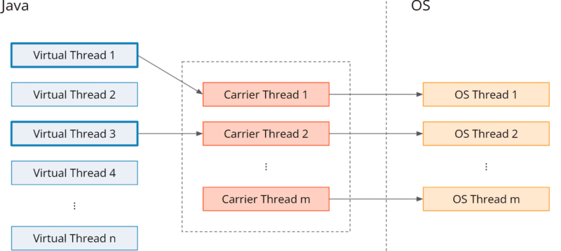
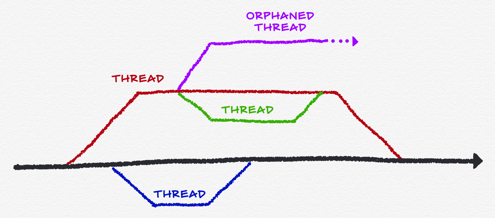
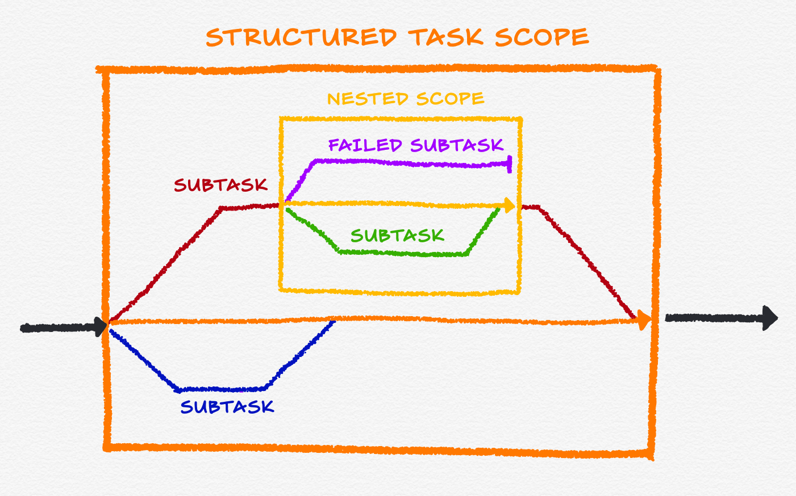

# Study Group: Java 18-21 

## Java 21
---

### String Templates (Preview)

In short, to simplify the writing of Java program and enhance readability.
STR is a public static final field and is automatically imported into every Java compilation unit


### Sequenced Collections

Introduce new interfaces to represent collections with a defined encounter order.


### Generational ZGC

Generational ZGC should be a better solution for most use cases than non-generational ZGC

``` shell
java -XX:+UseZGC -XX:+ZGenerational ...
```

ZGC does this via colored pointers, load barriers, and store barriers.

A colored pointer is a pointer to an object in the heap which, along with the object's memory address, includes metadata that encodes the known state of the object. The metadata describes whether the object is known to be alive, whether the address is correct, and so forth. ZGC always uses 64-bit object pointers and can therefore accommodate metadata bits and object addresses for heaps up to many terabytes. When a field in an object refers to another object, ZGC implements that reference with a colored pointer.

A load barrier is a fragment of code injected by ZGC into the application wherever the application reads a field of an object that refers to another object. The load barrier interprets the metadata of the colored pointer stored in the field and potentially takes some action before the application uses the referenced object.

ZGC only  
A store barrier is a fragment of code injected by ZGC into the application wherever the application stores references into object fields. Generational ZGC adds new metadata bits to colored pointers so that store barriers can determine if the field being written has already been recorded as potentially containing an inter-generational pointer. Colored pointers make Generational ZGC's store barriers more efficient than traditional generational store barriers.

For detailed  
https://openjdk.org/jeps/439 

### Record Patterns

a more declarative, data-focused style of programming

### Pattern Matching for switch


### Foreign Function & Memory API (Third Preview)

Introduce an API by which Java programs can interoperate with code and data outside of the Java runtime.

Goal: Ease of use, Performance, Generality, Safety


### Unnamed Patterns and Variables (Preview)


### Virtual Threads

At a high level, a thread is managed and scheduled by the operating system, while a virtual thread is managed and scheduled by a virtual machine. Now, to create a new kernel thread, we must do a system call, and that’s a costly operation.

virtual threads are managed by the JVM. Therefore, their allocation doesn’t require a system call, and they’re free of the operating system’s context switch.

virtual threads can significantly improve application throughput when
- The number of concurrent tasks is high (more than a few thousand), and
- The workload is not CPU-bound, since having many more threads than processor cores cannot improve throughput in that case.

Note:
Do not pool virtual threads




### Unnamed Classes and Instance Main Methods (Preview)

Unnamed classes are a significant feature designed to simplify the learning curve for beginners. It allows methods, fields, and classes to exist without explicit class declarations.


#### Rules to Create and Use an Unnamed Class
1. The ‘package’ Statement is Not Allowed

2. No Constructor is Allowed
Since we cannot refer to the unnamed class by its name, we cannot create a constructor as well.

It also means that we cannot create an instance of an unnamed class. That is why these classes are suited only for simple POC and learning purposes.

3. A main() Method must Exist
Since we cannot create a direct instance of an unnamed class, to make it usable, it must have a main() method to execute its code. Java compiler will throw an error if there is no main method.

4. Unnamed class cannot extend or implement
An unnamed class is always final and it cannot extend another class (except Object) or implement an interface.

5. Access to Static Members

### Scoped Values (Preview)

A scoped value is an implicit method parameter.  Scoped values make it possible to pass data securely from a caller to a faraway callee through a sequence of intermediate methods that do not declare a parameter for the data and have no access to the data.

The main difference between ScopedValue<T> and ThreadLocal<T> is the mutability of their inner value, and how the value’s lifetime is actually scoped.

#### ThreadLocal DownSide

1. Unconstrained Mutability  
Any code that can access the ThreadLocal<T> instance to call its get() method can also change the current value by calling set(T value). At first glance, this seems reasonable, even necessary to support the bi-directional flow of data between components.

2. Unbounded Lifetime  
Variables written to a ThreadLocal<T> has the same lifetime as, you guessed it, the thread it was written from unless you explicitly call remove(). That makes it easy to not properly clean up and accidentally leak data to another task.

3. Expensive Inheritance  
Container-types always add an inevitable overhead to fulfill their intended task. That’s the trade-off we must accept for getting the enhanced functionality. However, a thread bequeaths its child thread their own ThreadLocal<T> instances, as the children can’t access the parent’s one. That increases the required memory footprint, even if the children only need read-only access.

4. Overhead in Virtual Threads  
Virtual Threads (JEP 444), introduces more lightweight threads where multiple virtual threads implemented by the JDK share the same operating-system thread. This change allows us to use many more virtual threads compared to non-virtual ones, as they are way cheaper to use.


### Vector API (Sixth Incubator)

A vector computation is a sequence of operations that work on multiple data elements at the same time, such as complex math and array operations.
The Vector API has two main parts: the vector classes and the vector operations. the Vector API has a hardware dependency as it relies on SIMD instructions

```java
int[] a = {1, 2, 3, 4};
int[] b = {5, 6, 7, 8};
int[] c = new int[4];

// Vector computation
for (int i = 0; i < c.length; i++) {
  c[i] = a[i] + b[i];
} 

// vs
c[0] = a[0] + b[0];
```


### Deprecate the Windows 32-bit x86 Port for Removal

Deprecate the Windows 32-bit x86 port, with the intent to remove it in a future release.
Windows 10, the last Windows operating system to support 32-bit operation, will reach End of Life in October 2025.


### Prepare to Disallow the Dynamic Loading of Agents

Issue warnings when agents are loaded dynamically into a running JVM.   


An agent is a component that can alter the code of an application while the application is running.


### Key Encapsulation Mechanism API

Introduce an API for key encapsulation mechanisms (KEMs), an encryption technique for securing symmetric keys using public key cryptography.

### Structured Concurrency (Preview)

Structured concurrency treats groups of related tasks running in different threads as a single unit of work, thereby streamlining error handling and cancellation, improving reliability, and enhancing observability.

The principal class of the structured concurrency API is StructuredTaskScope in the java.util.concurrent package.

The general workflow of code using StructuredTaskScope is:

1. Create a scope. The thread that creates the scope is its owner.

2. Use the fork(Callable) method to fork subtasks in the scope.

3. At any time, any of the subtasks, or the scope's owner, may call the scope's shutdown() method to cancel unfinished subtasks and prevent the forking of new subtasks.
4. The scope's owner joins the scope, i.e., all of its subtasks, as a unit. The owner can call the scope's join() method, to wait until all subtasks have either completed (successfully or not) or been cancelled via shutdown(). Alternatively, it can call the scope's joinUntil(java.time.Instant) method, to wait up to a deadline.

5. After joining, handle any errors in the subtasks and process their results.

6. Close the scope, usually implicitly via try-with-resources. This shuts down the scope, if it is not already shut down, and waits for any subtasks that have been cancelled but not yet completed to complete.






## Java 20
---

### Scoped Values
### Record Patterns
###  Pattern Matching for Switch
### Foreign Function and Memory API
### Virtual Threads
### Structured Concurrency
### Vectored API
- No change compared to JAVA 19, a few bug fixes and performance enhancements

## Java 19
---

- Changes to Preallocated HashMap Creation

### Preview and Incubator Features

#### Pattern Matching for Switch
#### Record Patterns
#### Nested Record Patterns
#### Foreign Function & Memory API
#### Virtual Threads
#### Structured Concurrency
#### Vector api 
### Deprecated

- Locale Class Constructors Deprecated
- ThreadGroup Degraded
- Remove Finalizer Implementation in SSLSocketImpl


## Java 18
---
### Feature: 

- UTF-8 by Default
- Simple Web Server
- Code Snippets in Java API Documentation
- Vector API
- Internet-Address Resolution SPI
- Foreign Function and Memory API
- Pattern Matching Improvements
- Deprecated Finalization for Removal
protected void finalize()  
Unfortunately, finalization has several critical, fundamental flaws:

- Unpredictable latency — An arbitrarily long time may pass between the moment an object becomes unreachable and the moment its finalizer is called. In fact, the GC provides no guarantee that any finalizer will ever be called.

- Unconstrained behavior — Finalizer code can take any action. In particular, it can save a reference to the object being finalized, thereby resurrecting the object and making it reachable once again.

- Always enabled — Finalization has no explicit registration mechanism. A class with a finalizer enables finalization for every instance of the class, whether needed or not. Finalization of an object cannot be cancelled, even if it is no longer necessary for that object.

- Unspecified threading — Finalizers run on unspecified threads, in an arbitrary order. Neither threading nor ordering can be controlled.


---


## References
- https://openjdk.org/projects/jdk/21/
- https://www.baeldung.com/java-21-string-templates
- https://www.developer.com/java/java-18-features/
- https://www.jrebel.com/blog/java-19-features
- https://www.baeldung.com/java-20-new-features
- https://www.baeldung.com/java-21-string-templates
- https://www.happycoders.eu/java/virtual-threads/
- https://howtodoinjava.com/java/java-unnamed-class-instance-method/
- https://belief-driven-design.com/looking-at-java-21-structured-concurrency-39a81/
- https://belief-driven-design.com/looking-at-java-21-scoped-values-a78f1/